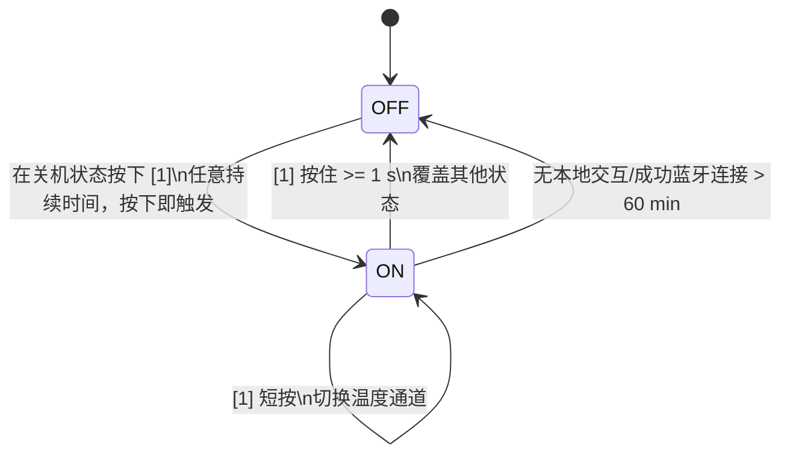
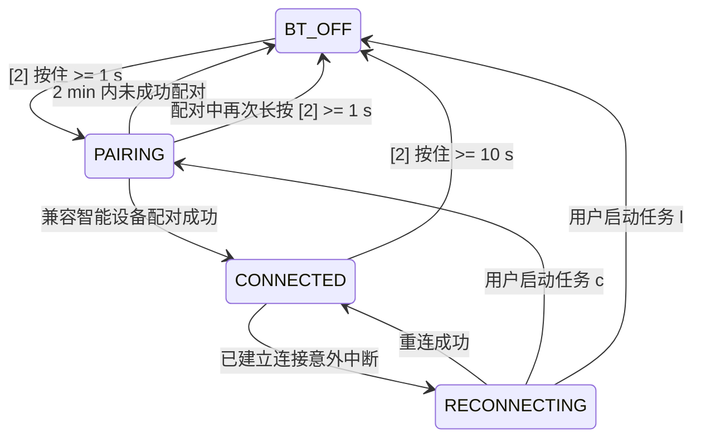
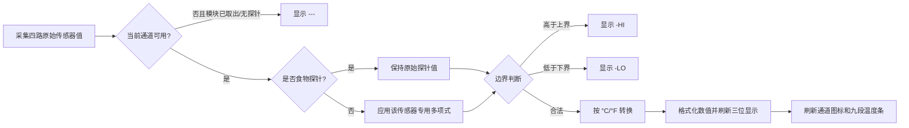

# Mathis UI Operational Logic V1.6 完整解析

> 解析对象：`260323_Mathis_UI_Operational_Logic-V1.6.xlsx`  
> 文档版本：V1.6  
> V1.6 发布日期：2026-06-01  
> 解析日期：2026-08-12  
> 目标：把原 Excel 中的控件说明、操作过程、状态切换、显示规则、异常行为和遗留问题，整理为可供产品、固件、测试共同使用的详细规格。

## 1. 结论摘要

Mathis 是一个带两枚实体按键、三位温度数码管、九段温度条、多个状态图标和 3.5 mm 食物探针接口的温度显示/蓝牙模块。

V1.6 的核心行为可归纳为五组状态：

1. **整机电源状态**：关机、开机、60 分钟无交互自动关机。
2. **蓝牙状态**：关闭、配对中、已连接、连接中断后重连。
3. **温度通道状态**：食物探针、O 表面、D 表面、腔体；默认显示 D 表面。
4. **显示单位状态**：默认摄氏度，可切换华氏度，并跨关机保存。
5. **安装/传感器状态**：模块是否装在 fascia（面板/饰板）内、探针是否连接、传感器值是否越界。

V1.6 明确新增或强化了以下内容：

- 温度条对表面/腔体通道采用 30～350°C、40°C 递增的九段阈值。
- 食物探针采用 10～90°C、10°C 递增的九段阈值。
- 所有温度通道都需要处理越界显示，不再只针对食物探针。
- 模块从 fascia 中取出后，只要探针仍连接，探针温度必须继续显示。
- O 表面、D 表面和腔体读数需要分别经过多项式校准；食物探针不校准。

当前文档仍存在会直接影响实现或验收的未决项，最重要的是：

- `Bugs and Improvements` 写有下限 `-20°C`，而正式流程 n 写为 `0°C`，两者冲突。
- 多项式阶数、系数、数据类型、运算顺序、无线更新协议与持久化方式未定义。
- 温度恰好等于上下界、数值取整、刷新频率、传感器断路/短路和越界时温度条行为未完整定义。
- 按键“按下即触发”会导致从关机开始的长按同时满足开机和关机条件，需要按键事件锁存规则。

## 2. 解析口径与证据等级

本文使用以下标记区分原始需求与解析建议：

- **原文要求**：Excel 中明确写出的行为，可直接作为需求依据。
- **确定性推导**：由原文阈值、界面段数或状态关系唯一推导出的结果，例如华氏阈值换算。
- **建议实现**：为了让固件状态机可落地而给出的实现方式，不等同于已经批准的产品需求。
- **待确认**：原文缺失、冲突或存在多种合理解释，不能擅自作为最终验收口径。

源工作簿包含四个工作表：

| 工作表 | 主要内容 | 解析结果 |
|---|---|---|
| `Change Log` | V1.0～V1.6 版本记录 | V1.6 声称更新过程 i、n、o |
| `Bugs and Improvements` | P1 样机问题与改进项 | 8 项；7 项标记 `NO`，1 项状态空白 |
| `Operation Process` | 控件定义与任务 a～P | 本文的主要需求来源 |
| `Reference Videos` | 参考视频表头 | 无文件名、链接或视频内容 |

三个 V1.6 副本中，可正常读取的 `5` 与 `TEST` 目录副本 SHA-256 完全相同：

```text
80B0A260ED1EE9D98CFD48065C0C43642D79CE022F375AC59607E2F00D42AE3D
```

因此本文以该一致内容为基准。工作簿无公式、批注、数据验证或单元格超链接；其核心是静态需求表和一张嵌入式 UI 标注图。

## 3. UI 与控件定义

> 资源待补：Mathis UI 控件编号图 `ui_control_map.png` 当前缺失。对应资源目录为 `260323_Mathis_UI_Operational_Logic-V1.6_完整解析.assets/`；补齐后恢复图片引用。

| 编号 | 名称 | 类型 | 交互/用途 |
|---:|---|---|---|
| [1] | On/Off Button | 实体按键 + LED | 按下；开机、关机、切换温度通道 |
| [2] | Bluetooth Button | 实体按键 + LED | 按下；切换单位、进入配对、关闭蓝牙 |
| [3] | Temperature Readout | LED 三位显示 | 显示温度、`-HI`、`-LO` 或 `---` |
| [4] | Temperature Gauge Line | LED 九段条 | 按当前通道温度分段点亮 |
| [5] | Probe Input | 3.5 mm 插孔 | 插入食物探针公头 |
| [6] | Probe Icon | LED 图标 | 当前显示通道为食物探针时点亮 |
| [7] | O Surface Temperature Indicator | LED 图标 | 当前显示 O 表面温度时点亮 |
| [8] | D Surface Temperature Indicator | LED 图标 | 当前显示 D 表面温度时点亮 |
| [9] | °C Indicator | LED 图标 | 当前单位为摄氏度时点亮 |
| [10] | °F Indicator | LED 图标 | 当前单位为华氏度时点亮 |
| [11] | Bluetooth Connection Indicator | LED 图标 | 配对/错误时 1 Hz 闪烁，连接时常亮 |
| [12] | Low Power Indicator | LED 图标 | 电压低于 1.1 V 时点亮 |
| [13] | Cavity Temperature Indicator | LED 图标 | 当前显示腔体温度时点亮 |

界面图显示温度条共有 **9 段**，从左到右依次点亮；色彩表现为低温段黄色、中温段橙色、高温段红色。原文只规定点亮段数和方向，没有把颜色变化写成逻辑阈值，因此固件不应仅凭图片推导颜色控制通道。

原文未解释 `O` 和 `D` 的英文全称。本文保留“O 表面”和“D 表面”的叫法，不扩展为未经确认的名称。

## 4. 建议的状态模型

### 4.1 最小状态变量

固件至少需要维护以下状态：

```text
power_state       = OFF | ON
bluetooth_state   = BT_OFF | PAIRING | CONNECTED | RECONNECTING
display_channel   = PROBE | O_SURFACE | D_SURFACE | CAVITY
display_unit      = CELSIUS | FAHRENHEIT
probe_present     = true | false
module_installed  = true | false
low_power         = true | false
last_activity_at  = timestamp
pairing_started_at = timestamp | null
```

另需维护四路传感器原始值、三组非探针多项式系数，以及单位偏好持久化值。

### 4.2 整机电源状态机



关键解释：

- **原文要求**：关机时按下 [1] 即开机，不必等待释放。
- **原文要求**：开机时按住 [1] 至少 1 秒即关机，不必等待释放，并覆盖任何其他状态。
- **建议实现**：记录一次按压开始时的电源状态。如果按压始于 `OFF`，只执行开机，并在本次释放前屏蔽“长按关机”，否则持续按住会先开机、1 秒后又关机。
- **待确认**：按键消抖时间、短按最大时长、1 秒阈值误差和长按事件是否只上报一次。

### 4.3 蓝牙状态机



蓝牙指示灯 [11]：

| 蓝牙状态 | [11] 行为 |
|---|---|
| `BT_OFF` | 熄灭 |
| `PAIRING` | 1 Hz 闪烁 |
| `CONNECTED` | 常亮 |
| `RECONNECTING` | 1 Hz 闪烁 |

配对中和连接错误都使用 1 Hz 闪烁，用户无法仅凭灯效区分两种状态。这是原设计结果，不是解析遗漏。

### 4.4 温度通道状态机

开机默认通道为：

```text
D_SURFACE
```

正常循环顺序按原文列举顺序整理为：

```text
PROBE → O_SURFACE → D_SURFACE → CAVITY → PROBE ...
```

如果未连接探针，则跳过 `PROBE`：

```text
O_SURFACE → D_SURFACE → CAVITY → O_SURFACE ...
```

插入探针时，不只是增加一个可选通道，而是**立即切换到探针读数**。当前通道对应的 [7]、[8]、[13] 熄灭，[6] 点亮。

**待确认**：

- 拔出当前正在显示的探针后，应回到 D 表面、上一个非探针通道，还是循环表中的下一个通道。
- 从 fascia 取出设备后，有探针时是否强制切换到探针；原文只明确“继续提供探针温度数据”。
- 重新开机是否总回到 D 表面。原文写“默认 D 表面”，但未明确通道是否持久化；按通常含义建议每次开机回 D 表面。

## 5. 操作过程 a～P 逐项解析

| 任务 | 名称 | 触发条件 | 系统动作 | 视觉反馈 | 关键约束 |
|---|---|---|---|---|---|
| a | 开机 | 关机时按下 [1]，任意时长 | LED 显示上电；默认显示 D 表面温度 | 显示 LED 亮度 100% | 按下即触发，无需释放 |
| b | 关机 | 开机时按住 [1] ≥1 s | LED 关闭；蓝牙关闭 | 所有显示 LED 熄灭 | 覆盖任何状态；按下满阈值即触发 |
| c | 开启蓝牙配对 | 按住 [2] ≥1 s | 设备变为可发现并允许智能设备连接 | [11] 以 1 Hz 闪烁 | 2 min 未配对则蓝牙关闭 |
| d | 蓝牙已连接 | 兼容智能设备完成配对 | 进入成功连接状态 | [11] 常亮 | 未定义兼容性判定和鉴权方式 |
| e | 切换温度单位 | 快速按下 [2] | °C 与 °F 切换 | [9]/[10] 互斥切换，[3] 同步换算 | 默认 °C；选择需要跨关机保存 |
| f | 温度数值显示 | 被动状态 | 默认显示 D 表面；也可由 h 切换 | [3] 显示当前输入；对应图标点亮 | 非探针通道显示经 P 调整后的值 |
| g | 连接探针 | 向 [5] 插入 3.5 mm 探针 | 开始读取并立即显示探针温度 | [6] 和 [3] 点亮；[7][8][13] 熄灭 | 未连接时 [6] 不亮 |
| h | 循环温度通道 | 快速按下 [1] | 在探针、O、D、腔体之间切换 | [6]/[7]/[8]/[13] 对应点亮，[3] 更新 | 无探针时跳过探针通道 |
| i | 温度条显示 | 被动状态 | 按当前显示通道温度计算点亮段数 | [4] 从左向右增加；达到最大后全亮且不闪烁 | 表面/腔体和探针采用不同阈值 |
| j | 低电量 | 电压 <1.1 V | 进入低电量提示状态 | [12] 点亮 | 恰好 1.1 V 的行为未定义；无迟滞要求 |
| k | 蓝牙连接错误 | 已建立的连接中断 | 开机剩余时间内持续尝试重连，除非执行 c 或 l | [11] 以 1 Hz 闪烁 | 重连周期、退避策略未定义 |
| l | 关闭蓝牙 | 已连接时按住 [2] ≥10 s；配对中按住 ≥1 s | 蓝牙关闭 | [11] 熄灭 | 不同蓝牙状态使用不同长按阈值 |
| m | 空闲自动关机 | 本地硬件无交互，或无成功蓝牙连接，持续 >60 min | 按任务 b 关机 | 同任务 b | “或”的精确定义及计时复位条件需确认 |
| n | 温度越界 | 任一传感器读数超出 0～500°C | [3] 不显示数字，改为边界错误提示 | 高于上界显示 `-HI`；低于下界显示 `-LO` | 与 Bugs 表的 -20°C 下限冲突 |
| o | 设备取出维护 | 用户从 fascia 中取出模块 | 无探针显示 `---`；有探针继续显示探针温度 | [3] 动态变化 | 表面/腔体不可用时的图标和温度条行为未定义 |
| P | 温度校准 | 被动状态 | O、D、腔体原始值分别经多项式调整；探针不调整 | 当前非探针通道显示调整值 | 多项式规格和系数管理未定义 |

## 6. 两枚按键的判定矩阵

### 6.1 On/Off Button [1]

| 当前状态 | 按压持续时间 | 动作 | 优先级 |
|---|---:|---|---:|
| `OFF` | 任意 | 立即开机，默认 D 表面 | 高 |
| `ON` | 短按，推定 `<1 s` | 切换显示通道 | 普通 |
| `ON` | `≥1 s` | 立即关机 | 最高，覆盖任何状态 |

必须避免在按住达到 1 秒前先发出“短按切换通道”。建议短按只在释放且持续时间 `<1 s` 时确认；长按在达到阈值时触发。

### 6.2 Bluetooth Button [2]

| 当前蓝牙状态 | 快速按压 | `≥1 s` | `≥10 s` |
|---|---|---|---|
| `BT_OFF` | 切换 °C/°F | 进入配对 | 已在 1 s 进入配对；后续是否关闭需防止重复判定 |
| `PAIRING` | 原文未限定，按任务 e 会切换单位 | 关闭蓝牙 | 关闭蓝牙 |
| `CONNECTED` | 切换 °C/°F | 1～10 s 行为未定义 | 关闭蓝牙 |
| `RECONNECTING` | 切换 °C/°F | 可按任务 c 重新进入配对，但状态优先级需确认 | 可按任务 l 关闭蓝牙 |

**建议实现**：蓝牙按键动作必须按当前蓝牙状态路由；不能把“≥1 s 进入配对”作为无条件全局动作，否则会与配对中关闭和已连接 10 秒关闭冲突。

## 7. 温度数据处理链

推荐把一次显示更新拆为以下步骤：



其中边界判断放在校准前还是校准后，原文没有明确。若边界代表传感器物理量程，应检查原始值；若边界代表给用户显示的有效温度，应检查校准值。此项必须由产品/算法负责人确认。

### 7.1 多项式调整

V1.6 只规定每个非探针传感器有独立多项式。一般表达式可写为：

```text
T_adjusted = a0 + a1·T_raw + a2·T_raw² + ... + an·T_rawⁿ
```

不能从 V1.6 确定：

- 多项式阶数 `n`。
- 每个传感器的系数值与系数数量。
- 输入/输出单位是否始终为 °C。
- 定点或浮点计算、缩放因子和溢出策略。
- 校准值的取整、限幅和异常处理。
- 系数无线更新的数据格式、版本号、CRC、回滚和掉电保存。

`Bugs and Improvements` 进一步要求各输入系数不同，并能无线更新；这条要求尚未合并为完整的 Operation Process 验收条款。

## 8. 温度条 [4] 的完整阈值

UI 图共有九段，因此 V1.6 的文字阈值可唯一展开为下表。

### 8.1 O/D 表面与腔体通道

| 点亮段数 | 摄氏阈值 | 华氏阈值（四舍五入） |
|---:|---:|---:|
| 0 | `<30°C` | `<86°F` |
| 1 | `≥30°C` | `≥86°F` |
| 2 | `≥70°C` | `≥158°F` |
| 3 | `≥110°C` | `≥230°F` |
| 4 | `≥150°C` | `≥302°F` |
| 5 | `≥190°C` | `≥374°F` |
| 6 | `≥230°C` | `≥446°F` |
| 7 | `≥270°C` | `≥518°F` |
| 8 | `≥310°C` | `≥590°F` |
| 9 | `≥350°C` | `≥662°F` |

确定性推导公式：

```text
segments_surface(Tc) = 0,                                  Tc < 30
segments_surface(Tc) = min(9, floor((Tc - 30) / 40) + 1), Tc >= 30
```

### 8.2 食物探针通道

| 点亮段数 | 摄氏阈值 | 华氏阈值（四舍五入） |
|---:|---:|---:|
| 0 | `<10°C` | `<50°F` |
| 1 | `≥10°C` | `≥50°F` |
| 2 | `≥20°C` | `≥68°F` |
| 3 | `≥30°C` | `≥86°F` |
| 4 | `≥40°C` | `≥104°F` |
| 5 | `≥50°C` | `≥122°F` |
| 6 | `≥60°C` | `≥140°F` |
| 7 | `≥70°C` | `≥158°F` |
| 8 | `≥80°C` | `≥176°F` |
| 9 | `≥90°C` | `≥194°F` |

确定性推导公式：

```text
segments_probe(Tc) = 0,                                  Tc < 10
segments_probe(Tc) = min(9, floor((Tc - 10) / 10) + 1), Tc >= 10
```

逻辑计算建议始终使用摄氏值，再只对显示阈值/数值做华氏换算，避免因华氏整数反算产生边界误差。

**待确认**：当 [3] 显示 `-HI`、`-LO` 或 `---` 时，[4] 应熄灭、保持上次状态，还是高温时全亮。原文没有规定。

## 9. 数值显示、图标与互斥关系

### 9.1 正常数值显示

- [3] 显示当前所选通道。
- O 表面、D 表面、腔体显示校准值。
- 食物探针显示未校准输入值。
- 单位切换后 [3] 必须立即更新为新单位对应数值。
- [9] 和 [10] 必须互斥：只能有一个点亮。
- [6]、[7]、[8]、[13] 在正常显示时应互斥：只点亮当前通道对应图标。

### 9.2 特殊字符串

| 条件 | [3] 内容 |
|---|---|
| 温度高于上边界 | `-HI` |
| 温度低于下边界 | `-LO` |
| 模块从 fascia 取出且无探针 | `---` |

原 UI 为三位数码显示，而字符串均为三字符，说明前导 `-` 是设计的一部分，不应擅自简化为 `HI`/`LO`。

### 9.3 边界语义

流程 n 同时写了“可接受边界 0～500°C”和“exceeds lower or upper boundaries”。最自然的实现解释是：

```text
T < 0°C     -> -LO
0°C..500°C -> 正常显示
T > 500°C   -> -HI
```

这是基于“0～500°C 为可接受范围”的解释。因为英文“exceeds the lower boundary”表述不严谨，测试前仍应确认 `0°C` 和 `500°C` 两个等值点。

## 10. 空闲关机逻辑

任务 m 的触发描述是：设备未通过本地硬件交互，**或**没有成功蓝牙连接，持续超过 60 分钟；说明文字又简化为“60 分钟未交互”。这里至少存在三种实现解释：

1. 任一本地交互或成功蓝牙连接都重置同一个 60 分钟计时器。
2. 仅本地按键/插拔探针重置计时器，蓝牙只在连接建立瞬间重置。
3. 蓝牙保持连接期间禁止自动关机。

建议产品确认后采用单一、可测试的定义。较符合省电目的且容易实现的候选规则是：

```text
last_activity_at = max(
  最后一次有效本地按键/探针事件时间,
  最后一次成功蓝牙连接或有效蓝牙命令时间
)

if now - last_activity_at >= 60 min:
    执行任务 b
```

原文一处使用 `>60 min`，另一处说“60 分钟”；应统一为 `>=60 min` 或严格 `>60 min`。

## 11. 设备取出与探针组合真值表

| 模块安装状态 | 探针状态 | 必须行为 | 未定义部分 |
|---|---|---|---|
| 已安装 | 未连接 | 显示 O/D/腔体；循环时跳过探针 | 拔出探针后的回退通道 |
| 已安装 | 已连接 | 插入时立即显示探针；可循环四通道 | 探针断线判定时间 |
| 已取出 | 未连接 | [3] 显示 `---` | 通道图标、单位图标、温度条状态 |
| 已取出 | 已连接 | [3] 继续提供探针温度 | 是否允许循环到不可用的表面/腔体通道 |

从 P1 问题 g 可知，样机曾在模块取出后无法显示探针温度；V1.6 任务 o 已明确修正目标。

## 12. 优先级建议

原文只有任务 b 明确写了“覆盖任何状态”。为了避免同时满足多个条件时显示不确定，建议采用以下事件/显示优先级，并由产品确认：

1. **长按 [1] 关机**：最高优先级，关闭显示和蓝牙。
2. **关机状态**：任何显示规则均不应点亮 LED。
3. **模块取出且无探针**：显示 `---`。
4. **当前有效通道越界**：显示 `-HI` 或 `-LO`。
5. **正常温度显示**：显示校准/未校准值、单位、通道图标和温度条。
6. **低电量与蓝牙图标**：作为并行状态叠加，不改变温度通道。

这里第 3 与第 4 的先后关系是建议值：模块取出后没有可用输入，优先显示 `---` 比显示残留传感器越界更合理，但原文未明确。

## 13. P1 Bugs and Improvements 解析

| 项目 | 现象/问题 | 要求或问题 | V1.6 状态 |
|---|---|---|---|
| h 温度通道循环 | 样机只有连接探针时才能循环 | 无探针也必须允许在 O/D/腔体间循环 | 标记 `NO`；流程 h 已写清跳过探针而非禁止循环 |
| n 温度越界 | 450°C 以上显示 `---`，没有 `HI` | 设置边界并加入 `HI`/`LO` | 标记 `NO`；但 Bugs 写 `-20～500°C`，流程 n 写 `0～500°C` |
| 结构/热设计 | 后部使用导热膏和飞线 | 询问量产最终方案 | 标记 `NO`；图片/视频单元格为 `#VALUE!` |
| LED 串光 | 显示区域存在 LED bleed | 询问能否改善 | 标记 `NO`；图片/视频单元格为 `#VALUE!` |
| 前屏密封 | 机身和前屏有缝且未密封 | 前面板应密封并齐平 | 标记 `NO`；图片/视频单元格为 `#VALUE!` |
| g 连接探针 | 模块取出壳体后不显示探针温度 | 模块取出后仍允许显示探针 | 标记 `NO`；流程 o 已增加相应文字 |
| 过温 | Agsun 测试显示多个部件过温 | 询问模块/烤炉是否增加防护 | 标记 `NO`；缺少测试数据和温度限值 |
| P 温度调整 | 原始传感器值与实测表面/空气温度不符 | 各输入独立系数，并能无线更新 | `Solved?` 空白；流程 P 已增加多项式，但更新机制未定义 |

重要结论：流程文字被更新并不等于 P1 问题已经验证关闭。Excel 中前七项仍标记 `NO`，温度调整项甚至没有填写解决状态。

`Reference Videos` 只有表头，没有任何文件名、链接或视频；因此当前工作簿无法提供视频级验收证据。

## 14. V1.5 → V1.6 的实际差异

除版本记录和新增问题外，逻辑变化如下：

- **过程 i**：
  - 明确九段条从温度读数左侧开始、从左向右点亮。
  - 表面/腔体最后一段由旧文档的 `>350°C` 改为 `≥350°C`。
  - 新增食物探针 10～90°C、每 10°C 一段的专用规则。
- **过程 n**：
  - 旧版只写 Probe Input [5] 越界；V1.6 扩展为所有传感器。
  - 旧版引用产品 PRD 的未列明边界；V1.6 在流程中写出 0～500°C。
- **过程 o**：
  - 新增模块取出但探针仍连接时继续显示探针数据。
- **过程 P**：
  - 新增 O、D、腔体独立多项式调整；探针不调整。
- **问题表**：
  - 新增“Temperature Adjustment”问题，要求各输入独立系数并支持无线更新。

V1.6 变更日志只写“更新过程 I、n、o”，没有提到新增过程 P，这是版本记录遗漏。

## 15. 文档内部不一致与缺口

### 15.1 必须在开发/验收前确认

| 编号 | 问题 | 影响 |
|---|---|---|
| GAP-01 | 正式流程下限 0°C，问题表下限 -20°C | `-LO` 判定和低温测试无法统一 |
| GAP-02 | 多项式阶数、系数和运算格式未定义 | 校准算法无法实现或跨平台复现 |
| GAP-03 | 系数无线更新协议和掉电保存未定义 | BLE 命令、Flash 布局与容错无法设计 |
| GAP-04 | 边界检查在校准前还是校准后未定义 | 同一输入可能产生不同 `HI/LO` 结果 |
| GAP-05 | 0°C、500°C 等值点语义不够严谨 | 边界用例可能出现一位差异 |
| GAP-06 | 数值取整/小数位/负数格式未定义 | 三位数码管显示规则不完整 |
| GAP-07 | 温度刷新频率、滤波和滞回未定义 | 显示抖动、温度条临界闪动 |
| GAP-08 | 传感器开路、短路、NaN 的显示未定义 | 异常输入可能误显示为正常温度 |
| GAP-09 | 探针拔出后的通道回退未定义 | UI 行为不唯一 |
| GAP-10 | 模块取出时图标和温度条行为未定义 | `---` 状态视觉反馈不完整 |
| GAP-11 | 越界/`---` 时温度条行为未定义 | 高温和无传感器状态可能保留旧段数 |
| GAP-12 | 空闲计时器的复位事件和蓝牙连接含义不明确 | 自动关机时间无法稳定验收 |
| GAP-13 | 蓝牙已连接时按住 1～10 秒的行为未定义 | 按键状态机可能误进配对 |
| GAP-14 | 从关机开始持续长按 [1] 的跨状态处理未定义 | 可能开机后立即关机 |
| GAP-15 | 低电量阈值无迟滞和采样时间 | 1.1 V 附近图标可能闪烁 |
| GAP-16 | 蓝牙重连间隔、超时、最大重试和功耗策略未定义 | 连接错误状态不可量化测试 |

### 15.2 文档质量问题

- `Operation Process!A1` 在 V1.6 中为无意义文本 `pl`，V1.5 原为 `Version`，疑似误编辑。
- 变更日志称 V1.6 更新过程 i，但过程 i 的 `Last Revision` 仍为 `1.0`。
- 过程 f、h 的文字在 V1.5 变更日志中被称为更新，但其 `Last Revision` 仍为 `1.4`。
- 过程 n 的触发条件把 `[6][7][8][13]` 称为 sensor readout；这些编号实际是图标，探针物理输入编号是 [5]。
- P 使用大写任务字母，其余为小写，引用时应做不区分大小写处理。
- 多处英文存在拼写或标点问题，但不改变本文的逻辑解析。

## 16. 建议的固件处理框架

以下伪代码是实现建议，不是源文档已有代码：

```c
on_power_button_down() {
    press_origin_power = power_state;

    if (power_state == OFF) {
        power_on();
        display_channel = D_SURFACE;
        suppress_power_long_press_until_release = true;
    }
}

on_power_button_hold(elapsed_ms) {
    if (power_state == ON &&
        !suppress_power_long_press_until_release &&
        elapsed_ms >= POWER_OFF_HOLD_MS) {
        power_off_all();
    }
}

on_power_button_up(elapsed_ms) {
    if (press_origin_power == ON && elapsed_ms < POWER_OFF_HOLD_MS) {
        display_channel = next_available_channel(display_channel,
                                                 probe_present,
                                                 module_installed);
    }
    suppress_power_long_press_until_release = false;
}

render_temperature() {
    if (!module_installed && !probe_present) {
        show_text("---");
        render_special_state_icons(); // 产品待确认
        return;
    }

    ensure_selected_channel_is_available();
    value_c = read_sensor(display_channel);

    if (display_channel != PROBE) {
        value_c = apply_polynomial(display_channel, value_c);
    }

    if (value_c > TEMP_MAX_C) {
        show_text("-HI");
        return;
    }
    if (value_c < TEMP_MIN_C) {
        show_text("-LO");
        return;
    }

    show_temperature(convert_for_selected_unit(value_c));
    show_exclusive_channel_icon(display_channel);
    show_exclusive_unit_icon(display_unit);
    show_gauge_segments(calculate_segments(display_channel, value_c));
}
```

建议把 UI 输出集中为一次“渲染提交”，不要由蓝牙、传感器、按键等模块分别直接写 LED，以避免互相覆盖和残留图标。

## 17. 可执行测试清单

### 17.1 电源与按键

| ID | 前置条件 | 操作 | 预期结果 |
|---|---|---|---|
| PWR-01 | 关机 | 短按 [1] | 按下即开机；显示 D 表面；LED 100% |
| PWR-02 | 关机 | 按住 [1] 超过 1 s 后释放 | 只开机一次，不应在同次按压中再次关机；此行为需确认后固化 |
| PWR-03 | 开机 | 短按 [1] | 切换到下一个可用温度通道 |
| PWR-04 | 开机 | 按住 [1] 0.99 s 后释放 | 按短按处理；阈值容差需按产品定义 |
| PWR-05 | 开机 | 按住 [1] 到 1.00 s | 立即关机，不等释放 |
| PWR-06 | 配对/连接/错误任一状态 | 按住 [1] ≥1 s | 所有 LED 熄灭，蓝牙关闭 |
| PWR-07 | 开机 | 无有效交互达到空闲阈值前 1 s | 保持开机 |
| PWR-08 | 开机 | 达到最终确认的 60 min 阈值 | 按任务 b 关机 |

### 17.2 蓝牙与单位

| ID | 前置条件 | 操作 | 预期结果 |
|---|---|---|---|
| BLE-01 | 蓝牙关闭 | 按住 [2] ≥1 s | 进入配对，[11] 1 Hz 闪烁 |
| BLE-02 | 配对中 | 2 min 未成功配对 | 蓝牙关闭，[11] 熄灭 |
| BLE-03 | 配对中 | 成功连接兼容设备 | [11] 常亮 |
| BLE-04 | 已连接 | 人为断开链路 | 进入重连，[11] 1 Hz 闪烁 |
| BLE-05 | 重连中 | 链路恢复 | [11] 常亮 |
| BLE-06 | 已连接 | 按住 [2] ≥10 s | 蓝牙关闭，[11] 熄灭 |
| BLE-07 | 配对中 | 按住 [2] ≥1 s | 蓝牙关闭，[11] 熄灭 |
| BLE-08 | 默认 °C | 快速按 [2] | 切至 °F；[9] 灭、[10] 亮；温度换算 |
| BLE-09 | 当前 °F | 关机再开机 | 仍为 °F |
| BLE-10 | 当前 °F | 再快速按 [2] | 切回 °C；[9] 亮、[10] 灭 |

### 17.3 温度通道与安装状态

| ID | 前置条件 | 操作 | 预期结果 |
|---|---|---|---|
| CH-01 | 无探针、开机 | 连续短按 [1] | O、D、腔体循环；绝不进入探针通道 |
| CH-02 | 无探针 | 插入探针 | 立即显示探针，[6] 亮，[7][8][13] 灭 |
| CH-03 | 有探针 | 连续短按 [1] | 探针、O、D、腔体均可访问 |
| CH-04 | 正显示探针 | 拔出探针 | 按最终确认的回退规则切换，且 [6] 熄灭 |
| CH-05 | 模块已安装、无探针 | 取出模块 | [3] 显示 `---` |
| CH-06 | 模块已取出、无探针 | 插入探针 | [3] 显示探针温度 |
| CH-07 | 模块已安装、有探针 | 取出模块 | 探针温度继续更新，不显示 `---` |

### 17.4 温度条边界

| ID | 通道/输入 | 预期段数 |
|---|---|---:|
| BAR-01 | 表面/腔体 29.9°C | 0 |
| BAR-02 | 表面/腔体 30°C | 1 |
| BAR-03 | 表面/腔体 69.9°C | 1 |
| BAR-04 | 表面/腔体 70°C | 2 |
| BAR-05 | 表面/腔体 349.9°C | 8 |
| BAR-06 | 表面/腔体 350°C | 9，全部常亮 |
| BAR-07 | 探针 9.9°C | 0 |
| BAR-08 | 探针 10°C | 1 |
| BAR-09 | 探针 89.9°C | 8 |
| BAR-10 | 探针 90°C | 9，全部常亮 |
| BAR-11 | 表面/腔体 86°F 显示模式 | 与 30°C 相同，为 1 段 |
| BAR-12 | 探针 194°F 显示模式 | 与 90°C 相同，为 9 段 |

### 17.5 边界、校准与低电量

| ID | 条件 | 预期结果 |
|---|---|---|
| TMP-01 | 任一有效通道高于最终上界 | [3] 显示 `-HI` |
| TMP-02 | 任一有效通道低于最终下界 | [3] 显示 `-LO` |
| TMP-03 | 输入恰好 0°C | 按确认后的包含边界规则验收；本文建议正常显示 |
| TMP-04 | 输入恰好 500°C | 按确认后的包含边界规则验收；本文建议正常显示 |
| TMP-05 | O、D、腔体输入相同但系数不同 | 三通道产生各自的校准结果 |
| TMP-06 | 探针输入 | 不应用任何 O/D/腔体多项式 |
| TMP-07 | 切换 °C/°F | 仅单位/显示转换，物理温度和段数不跳变 |
| BAT-01 | 电压 1.099 V | [12] 点亮 |
| BAT-02 | 电压 1.100 V | 原文只规定“小于”，建议 [12] 不亮；需确认 |
| BAT-03 | 电压在阈值附近带噪声 | 验证最终确定的滤波/迟滞规则 |

## 18. 需求追踪矩阵

| 需求域 | 来源任务 | 对应测试 |
|---|---|---|
| 开机/关机 | a、b | PWR-01～PWR-06 |
| 自动关机 | m | PWR-07～PWR-08 |
| 蓝牙配对/连接/错误/关闭 | c、d、k、l | BLE-01～BLE-07 |
| 单位切换与持久化 | e | BLE-08～BLE-10、TMP-07 |
| 温度显示与通道切换 | f、g、h | CH-01～CH-04 |
| 温度条 | i | BAR-01～BAR-12 |
| 低电量 | j | BAT-01～BAT-03 |
| 温度越界 | n | TMP-01～TMP-04 |
| 模块取出维护 | o | CH-05～CH-07 |
| 多项式温度调整 | P | TMP-05～TMP-06 |

## 19. 开发前建议冻结的参数表

建议由产品、算法、硬件、固件和测试共同确认并版本化以下参数：

```text
POWER_OFF_HOLD_MS
BT_PAIRING_HOLD_MS
BT_OFF_CONNECTED_HOLD_MS
BT_PAIRING_TIMEOUT_MS
IDLE_POWER_OFF_MS
BUTTON_DEBOUNCE_MS
TEMP_MIN_C
TEMP_MAX_C
LOW_BATTERY_THRESHOLD_V
LOW_BATTERY_HYSTERESIS_V
DISPLAY_REFRESH_MS
TEMPERATURE_FILTER_PARAMETERS
POLY_O_SURFACE[]
POLY_D_SURFACE[]
POLY_CAVITY[]
```

同时冻结以下枚举与协议：

- 通道循环顺序。
- 探针拔出回退通道。
- `-HI`、`-LO`、`---` 时所有图标和温度条状态。
- 传感器硬件错误码到 UI 的映射。
- 多项式系数无线更新命令、版本、校验、权限和回滚。
- 空闲计时器的全部复位事件。

## 20. 最终评价

V1.6 已能描述 Mathis UI 的主要用户路径，并解决了 V1.5 中温度条、全传感器越界、离机探针显示和非探针校准四个明显缺口。它适合作为产品行为草案和测试场景来源，但尚不足以单独作为“无歧义固件规格”。

若直接进入实现，最容易产生返工的四处是：

1. 0°C 与 -20°C 的下限冲突。
2. 校准多项式及无线系数更新缺少接口定义。
3. 两枚按键的长短按在不同状态下存在触发重叠。
4. `-HI`、`-LO`、`---` 和探针拔出时的完整 LED 输出未定义。

建议先关闭第 15 节的 GAP-01～GAP-16，再以第 17 节测试清单作为固件与 UI 联调的最低验收基线。
